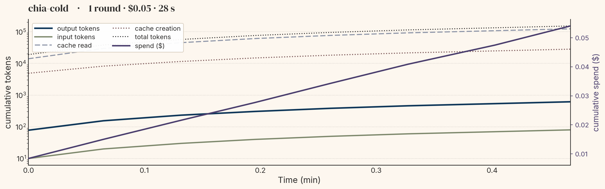
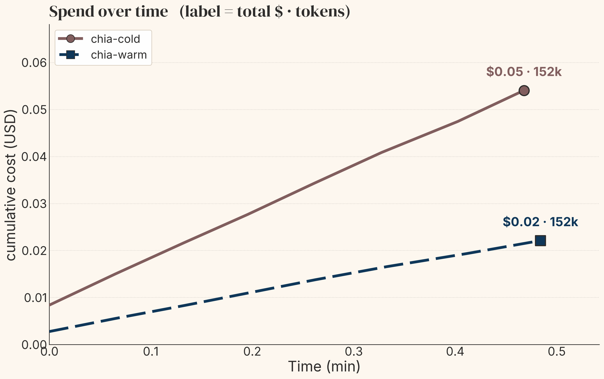

# A chia run, plotted by aet

`chia.trace.aet_sink` claims that a chia run directory **is** an aet run: point `aet plot` at
it and a figure comes out, with no chia code in the rendering path. Nothing in the
repository demonstrated that. The sink had unit tests, and `examples/harness_study` reads aet
run directories, but no artifact showed the whole path — profiled `@ChiaFunction` → collector
actor → sink → `aet plot` — actually closing.

This example is that artifact. It is also the answer to a question the sink could not answer
before: **where does a cached agent run's money actually go?**

## The finding

Two arms, eight `ClaudeCodeLLM.prompt` calls each, same prompts, same model
(`us.anthropic.claude-haiku-4-5-20251001-v1:0`), run back to back. The only difference is
whether the run started with a cold provider cache or inherited a warm one.

| arm | calls | input | output | cache **written** | cache **read** | total tokens | cost |
|-----|------:|------:|-------:|------------------:|---------------:|-------------:|-----:|
| cold | 8 | 80 | 616 | 28,156 | 123,236 | **152,088** | **$0.0541** |
| warm | 8 | 80 | 603 | 0 | 151,392 | **152,075** | **$0.0221** |

The token counts agree to within 0.01%. The cost differs by **2.45×**.

Every bit of that gap is which cache class the tokens landed in: a cache write bills at 1.25×
the input rate and a read at 0.1×, twelve and a half times apart. A two-class
(input/output) accounting model prices these two runs identically, and an accounting model
that records only `input + output + cache_total` — which is what aet's log reader did before
`fix/trajectory-cache-split` — cannot tell them apart either. That is the case for carrying
four token classes rather than two, stated as a measured number instead of an argument.



`aet plot --kind trajectory --split-cache` on the cold arm. Cache reads (dashed) run about
4.4× the cache writes (dotted) in token count, while the spend line climbs at a rate the
writes dominate. Source data: [`figures/trajectory.csv`](figures/trajectory.csv).



`aet plot --kind cost-vs-time` with both arms. The endpoint labels are the point of the
figure: `$0.05 · 152k` against `$0.02 · 152k`. Source data:
[`figures/trajectory.csv`](figures/trajectory.csv) and
[`figures/trajectory_warm.csv`](figures/trajectory_warm.csv).

## Reproducing it for $0

Both figures rebuild from the committed per-call logs, with no credentials and no spend:

```bash
# chia's venv — rebuild the two run directories
python examples/aet_trajectory/run.py --replay examples/aet_trajectory/data/cold_calls.jsonl \
    --run-dir /tmp/cold --run-id chia-cold --csv /tmp/cold.csv
python examples/aet_trajectory/run.py --replay examples/aet_trajectory/data/warm_calls.jsonl \
    --run-dir /tmp/warm --run-id chia-warm --csv /tmp/warm.csv

# aet's venv — render them
aet plot /tmp/cold --kind trajectory --split-cache --out /tmp/trajectory.png
aet plot /tmp/cold --kind cost-vs-time --comparison /tmp/warm --out /tmp/cost_vs_time.png
```

`/tmp/cold.csv` will be byte-for-byte `figures/trajectory.csv`. The committed rows carry the
costs the *backend* reported, so nothing on the replay path re-derives a number from a local
rate table that could drift out from under the figure — which is what makes the replay the
same run rather than a lookalike. `test_run.py` asserts the equality with an exact
comparison; if a tolerance ever becomes necessary there, something has started recomputing.

The logs hold counts, costs and timestamps and nothing else — no prompt text, no responses,
no environment. `test_run.py` checks that by field allowlist rather than by scanning for
secrets, because an allowlist fails closed when a field is added and a scan only fails after
a secret is already committed.

## Running it live

```bash
python examples/aet_trajectory/run.py --calls 8 --run-dir /tmp/chia_aet_demo
```

About $0.05 for eight calls on Haiku. `--dry-run` reports what it would do without calling
anything; `--cap-usd` (default 2.0) is checked by `chia.base.budget.check_budget` **before**
dispatch, because a projection consulted after the money is gone is not a cap.

Then render it — from aet's venv:

```bash
aet plot /tmp/chia_aet_demo --kind trajectory --split-cache \
    --out examples/aet_trajectory/figures/trajectory.png
```

### The venv split is the evidence, not a workaround

chia's venv has aet installed but **no matplotlib**; aet's has matplotlib but **no chia**. The
two processes share nothing but the run directory. So a figure coming out of the second
command means the directory carried everything the plot needed — which is precisely the claim
being tested. Documenting it as a two-venv procedure is more honest than hiding it behind a
wrapper that imports both.

## What the run directory contains

```
<run-dir>/
  run_record.json          run identity: run_id, project, suite, source=chia, llm_calls
  logs/metrics.jsonl       scalars + the aet.traj.* step-metric families (the curves)
  logs/events.jsonl        aet.traj.round — one boundary spanning the chia run
  logs/params.json         aet.traj.summary — run-level totals, including the cache split
  calls.jsonl             the per-call log, for --replay
  profiler/                the raw chia profiler trace the fold was built from
  cli_logs/                the CLI's own transcripts
```

The `aet.traj.*` step-metric families, keyed by point index:

| metric | what it is |
|--------|------------|
| `aet.traj.t_s` | seconds since the run's first call |
| `aet.traj.cum_input_tokens` | cumulative uncached input |
| `aet.traj.cum_output_tokens` | cumulative output |
| `aet.traj.cum_cache_read_tokens` | cumulative cache hits — billed ~0.1× input |
| `aet.traj.cum_cache_creation_tokens` | cumulative cache writes — billed ~1.25× input |
| `aet.traj.cum_cache_tokens` | the two above summed, which is what aet's cost model bills as one class |
| `aet.traj.cum_cost_usd` | cumulative spend |
| `aet.traj.provisional_cost` | 1.0 where the cost is an estimate rather than the provider's figure |

## Notes on how the run is set up, and why

Four things in `run.py` are not arbitrary, and each cost a wrong run to find out:

**`log_stream=True` is required, not a logging preference.** The streaming path is the one
that reads the CLI's `stream-json` output, where the per-turn token counts live. The plain
`--print` path returns text and no usage at all — the first version of this example ran fine,
answered every question correctly, and wrote a trajectory of zeros.

**`resources={"claude_creds": 1}` on `ray.init`.** `ClaudeCodeLLM.prompt` is
`@ChiaFunction(resources={"claude_creds": 0.01})`; that gate is how chia stops N workers
stampeding one credential. A local Ray cluster advertises no custom resources, so without
this the task queues forever — which presents as a hang and is really a missing gate.

**`runtime_env={"env_vars": overlay}`.** `bedrock_model_env` builds the variables that point
the CLI at Bedrock, and the CLI subprocess is launched on the *worker*. Env vars set on the
driver do not cross that boundary on their own.

**A per-run nonce in the system prompt.** The provider keys its cache on prefix content and
holds an entry for minutes, so a second run started soon after the first inherits a warm
cache and every one of its calls is a read — a trajectory with no cache-write structure in
it, which is exactly what an earlier attempt here produced. Tagging the prefix per run forces
a genuine cold start. It does not fake one: the shape it produces is the shape a first-ever
run has. Passing `--nonce <the cold arm's value>` is how the warm arm above deliberately
reuses the cold arm's cache.

## Requirements

- `pip install 'chia[aet]'` for the sink; `pip install 'aet[viz]'` in a separate venv for `aet plot`.
- Bedrock credentials (`AWS_BEARER_TOKEN_BEDROCK`, `AWS_REGION`) for the live path only.
- The `--replay` path needs neither.
