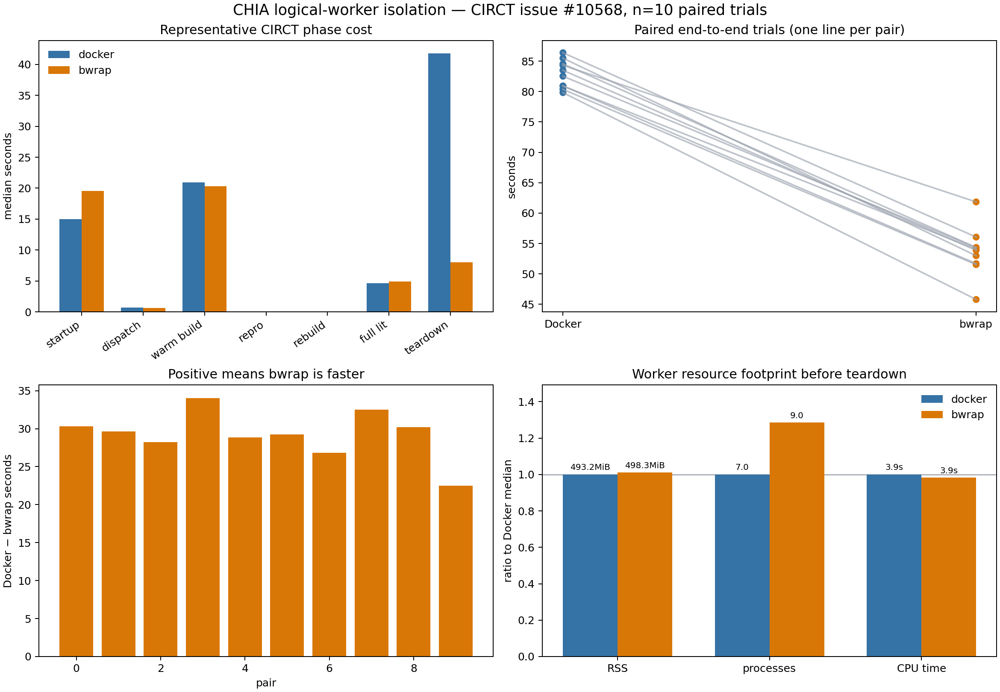

# Bubblewrap logical-worker result

This directory contains the reproducible evidence for comparing CHIA's Docker
worker backend with the bubblewrap logical-worker backend on the CIRCT issue
solver workload.



## Result

Ten randomized paired trials passed every predeclared validity gate. Bubblewrap
reduced median end-to-end time from 83.01 seconds to 53.97 seconds, a 34.98%
reduction in the arm medians. The median paired saving was 29.43 seconds. A
10,000-sample paired bootstrap gives a 95% confidence interval of 27.84 to
31.36 seconds saved, excluding zero. The analyzer therefore returns `go`
against the predeclared 5% threshold.

| Median | Docker | Bubblewrap | Interpretation |
| --- | ---: | ---: | --- |
| Startup | 14.99 s | 19.54 s | Bubblewrap starts 4.55 s slower |
| 100 dispatches | 0.713 s | 0.653 s | Similar steady-state dispatch cost |
| Warm CIRCT build | 20.96 s | 20.33 s | Similar compilation cost |
| Full 1,022-test lit suite | 4.62 s | 4.92 s | Similar test cost |
| Teardown | 41.80 s | 7.99 s | Main source of the total improvement |
| End to end | 83.01 s | 53.97 s | Bubblewrap is 34.98% faster overall |
| RSS before teardown | 493.2 MiB | 498.3 MiB | Roughly equal memory footprint |
| Worker processes | 7 | 9 | Bubblewrap uses two more processes |

Every one of the 20 arms completed worker startup, 100 Ray calls, warm and
no-op rebuilds, all 1,022 applicable tests, the frozen issue-10568 command,
scoped teardown, and a zero-leak check. Ccache was disabled in both arms. Docker
and bubblewrap used independent fresh writable snapshots copied from the same
pinned image/rootfs.

## What this proves—and what it does not

The result supports bubblewrap for short-lived CHIA logical-worker clusters on
this host. It does not show that bubblewrap makes CIRCT compilation faster: the
build, dispatch, test, CPU, and RSS medians are close. Nearly all of the gain is
Docker lifecycle teardown. Long-lived clusters that rarely tear down will
amortize that advantage, while bubblewrap's slower startup remains a cost.

Bubblewrap also supplies process/filesystem isolation without a Docker daemon,
but it is not an image runtime. The host must supply a compatible rootfs and the
implementation deliberately fails closed if bubblewrap or required mounts are
unavailable.

## Files

- `circt-isolation-10-pairs.jsonl`: manifest and all 20 raw arm records.
- `trials.csv`: flattened phase, end-to-end, and resource measurements.
- `summary.json`: validity criteria, bootstrap interval, and go/no-go decision.
- `circt-isolation.png`: four-panel representative visualization.

Regenerate the summary and plot with:

```bash
python isolation_benchmark_analysis.py \
  --input results/bwrap/circt-isolation-10-pairs.jsonl \
  --output results/bwrap/summary.json
python isolation_benchmark_plot.py \
  --input results/bwrap/circt-isolation-10-pairs.jsonl \
  --png results/bwrap/circt-isolation.png \
  --csv results/bwrap/trials.csv
```
