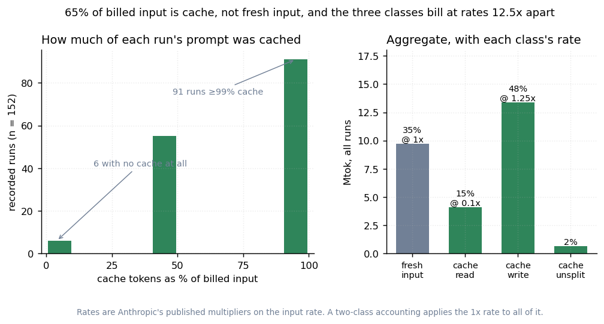
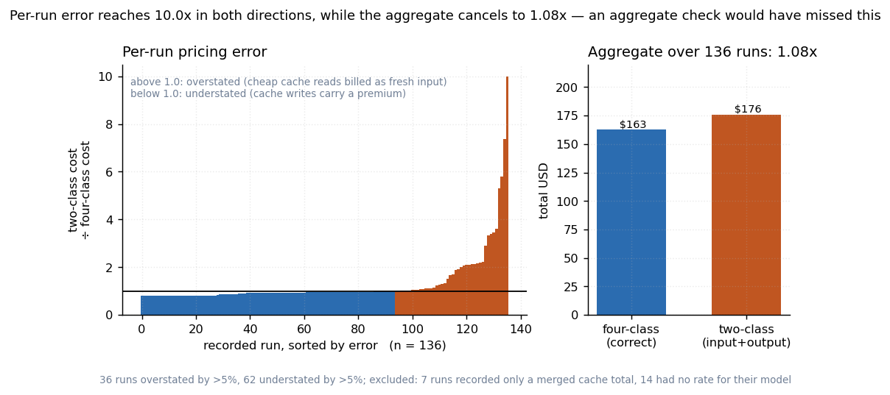
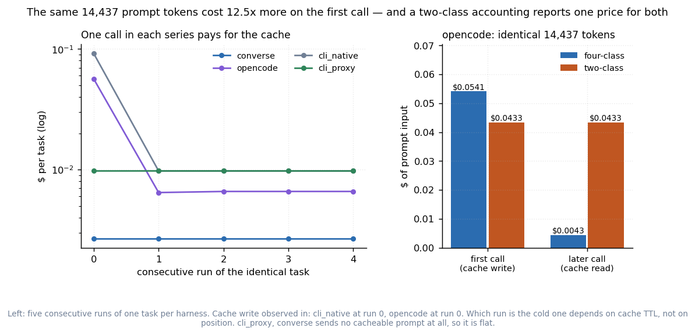
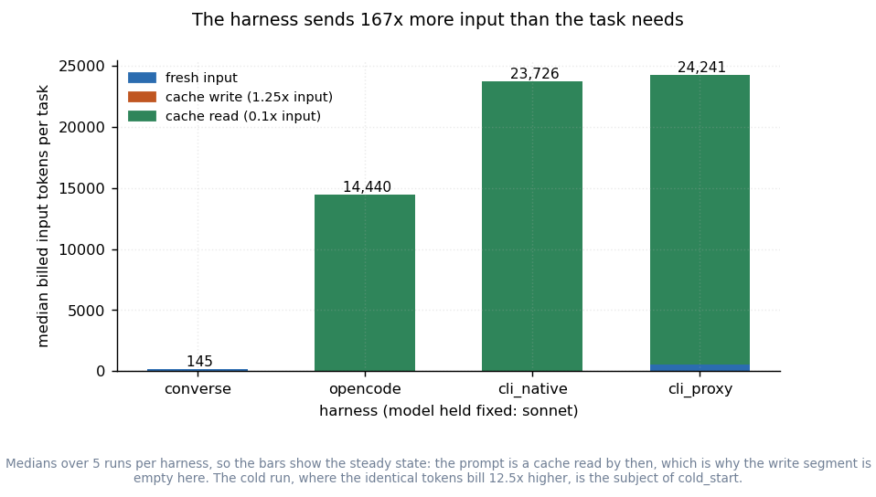
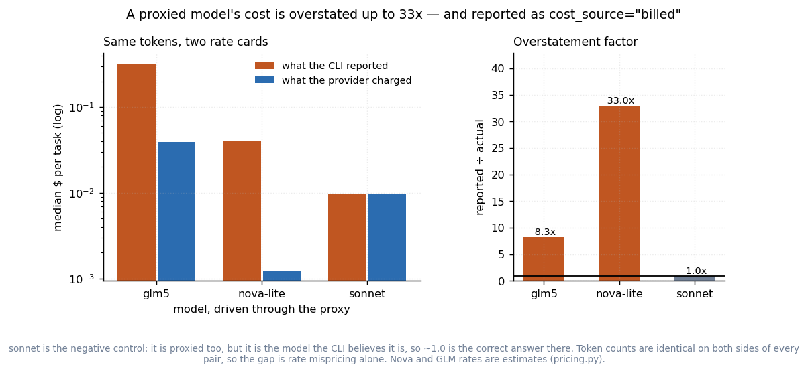
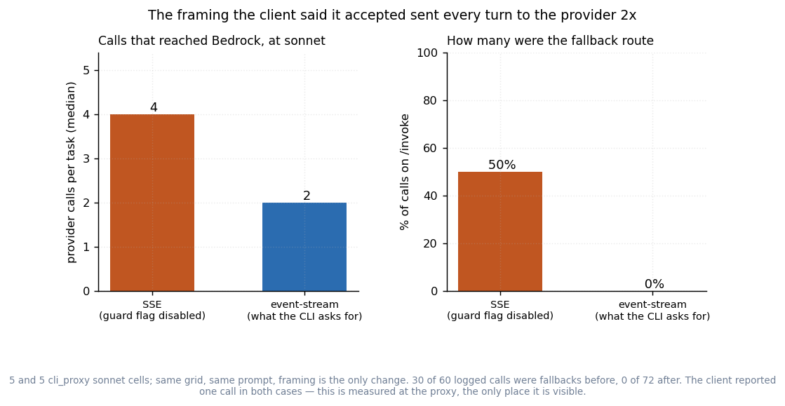
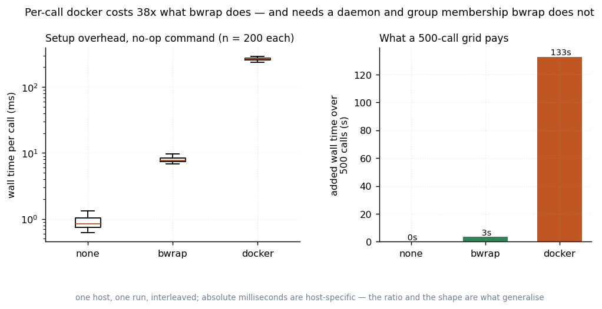

# harness_study — measuring what chia's telemetry gets wrong, and what it costs

Seven figures, each testing one claim against a committed CSV. This directory does not
exist to argue for the changes on the surrounding branches; it exists to produce the
numbers that decide whether they are worth having — including the ones that came out
against them, and the two that showed earlier claims in this repository were wrong.

```
pricing.py      the rate table, and the two ways of pricing a call that this compares
collect.py      readers: chia profiler log / aet run dirs / spec results.jsonl -> tidy CSV
grid.py         the live harness x model factorial
plots.py        the figures; each reads a CSV and hardcodes nothing
data/           the committed CSVs
figures/        the generated PNGs, each beside the exact rows it drew
```

## Four rules the figures follow

1. **Every figure reads a CSV.** No number is typed into `plots.py`, and no caption
   asserts something the rows do not contain.
2. **Every figure ships its own source data.** `figures/<name>.csv` is exactly the rows
   behind `figures/<name>.png`.
3. **Every proportion carries its denominator.** A rate over 5 trials must not render
   like a rate over 500.
4. **A figure has to earn the space.** Three were drawn and then cut — see
   [what was cut](#three-figures-that-were-cut-and-why). A weak figure does not add
   support, it spends the reader's trust.

---

## 1. The prompt cache is most of the bill, and the classes bill 12.5x apart



**65% of all billed input across 152 recorded runs is prompt cache, not fresh input.**
91 of those runs are ≥99% cache — single-digit `input_tokens` against tens of thousands
of cache tokens. 6 have no cache at all.

The right panel is why that matters: a cache *read* bills at 0.1x the input rate and a
cache *write* at 1.25x, so the three classes are **12.5x apart**. A two-class accounting
(`input + output`) applies the 1x rate to all of it.

Everything downstream depends on this. **If the cache share were small, splitting the
input classes would be pedantry** — that is the falsifier, and it did not happen.

## 2. Two-class pricing passes an aggregate check while every per-run number is wrong



Per run, pricing every input token at the fresh-input rate is wrong by up to **10x, in
both directions**: read-heavy runs overstated, write-heavy runs understated. 36 of 136
runs are overstated by more than 5%, 62 understated by more than 5%.

Over the whole corpus those errors **cancel to 1.08x** — $176 against a true $163.

That aggregate is the finding, not a disappointment. A program-level spend check would
have looked fine while every *per-run* comparison was wrong by a factor of several. "Model
A is cheaper per task than model B" is exactly a per-run comparison, and so is every cost
axis in this directory.

> **Correction.** An earlier note in this repository put this at 2.4x. That figure came
> from one downstream project's recorded mix, not from anything measured here. 1.08x is
> what this corpus shows.

## 3. The same tokens, billed 12.5x apart, reported as one price



This is the sharpest result in the set, and the one that turns figure 1 from a description
into a defect.

Five consecutive runs of one task, per harness, at one model. One call in each series
writes the prompt cache; the rest read it. **The token count is identical** — 14,437 for
opencode — and only the class changes. Four-class pricing puts those two calls at $0.0541
and $0.0043. Two-class pricing reports **$0.0433 for both**.

No averaging, no inference, no model difference: same prompt, same harness, same model,
consecutive runs. Which run is the cold one depends on cache TTL rather than position, and
the figure names the ones it observed rather than assuming the first.

## 4. At a fixed model, the harness sets the bill



Model held fixed at sonnet, harness varied. The bars are what each harness sends **before
the task starts** — its system prompt and tool definitions.

| harness | median billed input tokens/task | vs raw Converse |
|---|---:|---:|
| `converse` (chia's `BedrockLLM`) | 145 | 1x |
| `opencode` | 14,440 | 100x |
| `cli_native` (Claude Code CLI) | 23,726 | 164x |
| `cli_proxy` (CLI through the proxy) | 24,241 | 167x |

It is a count of tokens, the same count every run, so it needs no statistics to believe.


Cost per task, priced from the provider's own token counts, median of 5 runs per cell
(the mean would report the cache lifecycle of figure 3 rather than the harness). Cost
only: the task was solved in **48 of 50** live cells, which is far too few trials to rank
the harnesses on quality, and drawing 5-trial success rates as bars would invite exactly
that reading.

## 5. opencode is cheaper than Claude Code at the same model

This is the question a reviewer actually asks — *why not just use opencode?* — and the
answer is not the one the proxy would prefer.

At sonnet, opencode sends 14,440 billed input tokens per task against Claude Code's
23,726, and costs **$0.0066 against $0.0097** per task. It also reaches every model here
through its `amazon-bedrock` provider. **On cost and on reach, opencode wins.**

So the proxy cannot be justified on cost, and this figure is why. What it uniquely provides
is narrower and worth stating precisely: it is the only way to drive a non-Anthropic model
with **the Claude Code harness** — its subagents, hooks, skills, and
`--session-id`/`--resume`, which is the machinery chia's `ClaudeCodeLLM` already builds on.
That is a capability argument, not a cost one.

> **Correction, and it was mine.** An earlier `grid.py` pointed opencode at
> `anthropic/claude-sonnet-4-6` — a provider with no credentials on this host — and at
> `None` for the other two models, then recorded the results as *"opencode has no route to
> this model"* and *"harness unavailable on this host"*. Both were false. opencode's
> catalogue carries no cross-region prefix for Nova while it does carry one for the
> Anthropic ids, so a Bedrock id copied across verbatim does not resolve, and opencode
> reports every startup failure as the same opaque *"Unexpected server error"*. The evidence
> that it worked was already on this host: 3,065 successful `amazon-bedrock/zai.glm-5`
> streams in its own log. `fix/opencode-error-surfacing` makes chia diagnose that class of
> failure instead of mis-attributing it.

## 6. A proxied model's cost is misreported — and marked authoritative



The Claude Code CLI prices what it *believes* it called. Drive a non-Anthropic model
through the proxy and it applies Claude's rate card, then reports the result as
`cost_source="billed"`.

This is a controlled comparison, which is what makes it worth a figure: **the token counts
are identical on both sides.** The proxy records the counts the provider returned for the
very call the CLI then priced, so the ratio is rate mispricing alone, with no confound from
prompt size.

| model, through the proxy | CLI reported | provider charged | overstatement |
|---|---:|---:|---:|
| sonnet (**negative control**) | $0.00975 | $0.00975 | **1.0x** |
| glm5 | $0.32506 | $0.03932 | 8.3x |
| nova-lite | $0.04062 | $0.00123 | **33.0x** |

sonnet is the control: it is proxied too, but it *is* the model the CLI thinks it is, so
1.0x there is the correct answer, and anything else would mean the measurement is wrong
rather than the CLI. It came out at exactly 1.0 — after a first attempt came out at 1.13x
and turned out to be my own aggregation pricing the CLI's separate haiku call at the
primary model's rate. That is what a control is for.

> **Correction.** An earlier note put this at "~400x". That number compared
> CLI-through-proxy against *raw Converse*, which differ in both token volume and rate
> card — it multiplied figure 4's prompt overhead by the mispricing and attributed the
> product to mispricing alone. At identical tokens it is 33x for Nova-Lite and 8.3x for
> GLM-5.

## 7. The framing the client said it accepted sent every turn twice



The proxy originally answered in `text/event-stream` and set
`CLAUDE_CODE_DISABLE_BEDROCK_CONTENT_TYPE_GUARD=1` on the client to make it accept that.
End to end it looked correct: the CLI printed the answer, and the deviation was documented
as a deviation.

It was not correct. With per-call usage recording switched on, **every proxied turn reached
Bedrock twice** — once on `/invoke-with-response-stream`, then again with the same body on
`/invoke`. The CLI was failing to parse the SSE stream and silently retrying non-streaming,
then reporting the cost of the one call it accepted. A 2x provider bill, invisible in the
client's own telemetry. **30 of 60 logged calls were fallbacks; after the fix, 0 of 72.**

Both panels are counts, so neither needs a rate table or an assumption about variance.

The cache buckets are what make the mechanism unarguable rather than inferred: on one turn
the streaming call *wrote* 9,963 cache tokens and the fallback call *read* 23,469 of them.
Only two calls that both reached the provider can do that.

`chia/models/proxy/eventstream.py` now implements AWS's binary framing, verified by
decoding it with **botocore's own parser** rather than a second implementation of the
format. The guard flag is no longer set anywhere, so the design no longer depends on
undocumented CLI surface.

None of this was visible until the proxy started writing down what it spent.

## 8. Per-call isolation is affordable — with bwrap, not with per-call docker



n=200 per backend, interleaved, over a no-op command, so the number is setup cost and
nothing else: **bwrap adds 6.9 ms per call, per-call docker adds 265 ms — 38x.** Over a
500-call grid, 3 seconds against 2.2 minutes.

Absolute milliseconds are host-specific; the ratio and the tightness of the distributions
are what generalise, and the figure says so. Method, and the two bugs this benchmark found
by being run, are in [`../sandbox_overhead/README.md`](../sandbox_overhead/README.md).

---

## Three figures that were cut, and why

Drawn, looked at, removed. What they said is kept here as text, which is the form it
deserved.

**Independent reimplementation count.** Five small integers are a table:

| capability | independent implementations across chia / aet / oscar-merlin / spec |
|---|---|
| per-call agent sandbox | **3** |
| token price table | **3** |
| Bedrock model registry | **3** |
| usage-key normalization | **3** |
| Converse tool loop | 2 |
| opencode stream parsing | 2 |

The sandbox row is why this is still worth stating: spec's copy carries a drift test that
loads aet's module *by path* and asserts both builders emit identical argv — one downstream
project defending itself against divergence from another downstream project, because
neither could rely on the framework. Source: `data/reimplementations.csv`.

**Retry visibility.** A bar chart of a binary is a sentence: of 332 recorded cells, 11
retried at least once, 22 attempts in total, and for **none** of them are the tokens those
attempts burned recoverable from the record — a retry was an integer, and every backend
cleared its per-attempt metadata before the next attempt. The y-axis was deliberately
*visibility* rather than lost dollars, because putting a dollar figure on those attempts
would invent the number the fix exists to produce. Source: `data/retries.csv`.

**Deletion ratio.** Downstream workaround lines deleted per upstream line added, per PR.
Cut because the denominator is "how much code I wrote", which makes it an argument dressed
as a measurement — and four of eight PRs score 0.00 because no downstream workaround was
possible at all. The honest version is one sentence: two of these changes delete a real
downstream shim (ratios 2.30 and 0.45) and the rest have to stand on whether they correct a
number, not on lines saved. Source: `data/deletion_ratio.csv`.

## What is not measured here

- **Quality.** n=5 per cell establishes cost, which is mechanical and low-variance. It
  establishes nothing about success rates, and no figure here claims to. 48 of 50 live
  cells passed; the 2 failures were on the two non-Anthropic models.
- **The tier-mix ablation.** Whether delegating subagent turns to a cheap model degrades
  the outcome is the measurement that would make `ModelTier` more than configuration.
  Not run.
- **Leakage.** Whether a sandbox changes an experiment's score, and how often an agent
  reaches a denied path, is the validity claim behind the per-call sandbox. The mechanism
  is covered by tests that run real `bwrap`; the *rate* is not measured.
- **Rate limits.** No local number at all. The evidence for wait-and-resume is a downstream
  project's 18 lost rows, which is secondhand.
- **GLM and Nova rates are estimates.** GLM-5's rate tuple is unconfirmed (sourced from
  `oscar-merlin/merlin/experiments/capsule_bench/bedrock_prices.yaml`, which says so
  itself) and Nova publishes no separate cache rates. `pricing.rate_is_estimated()` marks
  both, and any figure that prices them says so in its caption. The Anthropic figures —
  including every negative control — use published rates.

## Reproducing

```bash
# Figures from the committed CSVs. Needs matplotlib; nothing else here does.
python examples/harness_study/plots.py                  # all
python examples/harness_study/plots.py pricing_error    # one

# Re-derive the CSVs from recorded telemetry (paths are yours to supply):
python examples/harness_study/collect.py \
    --aet-runs /path/to/aet/run/roots \
    --results-jsonl /path/to/results.jsonl \
    --chia-profile /tmp/ray/<job>/ChiaProfileCollector.log

# The live grid. Start the proxy with the same --usage-log first, or cli_proxy's cost is
# only what the CLI claimed — which figure 6 is about.
python -m chia.models.proxy.server --port 8123 \
    --usage-log examples/harness_study/data/proxy_usage.jsonl &
python examples/harness_study/grid.py --repeats 5 --cap-usd 15
```

The last live run: 60 cells, 50 of them live, **$0.53** of metered spend. `check_budget`
runs before any dispatch and refuses a grid that would cross the cap, projecting from the
per-call spend already in `data/harness_grid.csv`.

## Provenance notes

- The rate table in `pricing.py` is duplicated rather than imported from aet, so a figure
  cannot change under a dependency update. Each entry's source is in the comment beside it.
- `collect.py` reads aet's scalars under aet's own last-occurrence-wins rule, because that
  is the rule the numbers were written under. Reading them any other way would measure the
  reader.
- The committed CSVs carry identity, token counts, cost and retries only. Free-text failure
  detail, prompt paths and target names are dropped: the figures do not need them, and a
  committed CSV should carry no more of an experiment than the claim it supports.
- `data/harness_grid_sse_framing.csv` and `data/proxy_usage_sse_framing.jsonl` are the
  pre-fix run, kept deliberately: they are the other half of figure 7.
